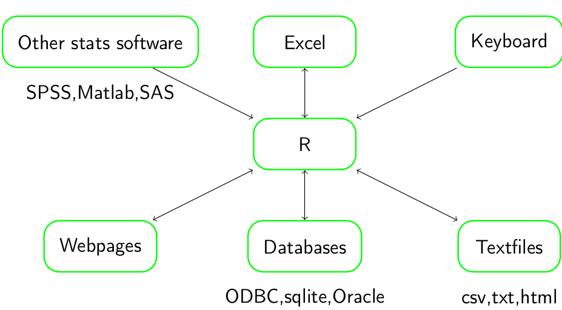

```{r, echo = FALSE}
knitr::opts_chunk$set(warning = FALSE,
                      message = FALSE)
```

```{r}
library(tidyverse)
library(haven)
library(readxl)
```

## Sources of data 



## Reading material
* http://r4ds.had.co.nz/data-import.html

# Keyboard

one can simply enter data directly to the console
```{r}
weight <- c(1,5,3,2,6)
length <- c(10,17,14,12,18)
plot(length,weight)
```

or if you want a more structured entry one can :
```{r}
d <- data_frame(weight = c(1,5,3,2,6),
                length = c(10,17,14,12,18))
ggplot(d,aes(length,weight)) + geom_point()
```

R even has a built data entry window:
```{r,eval=FALSE}
dat <- data.frame(id=numeric(0), species=character(0),
                  length=numeric(0),age=numeric(0),
                  lat = numeric(0),lon=numeric(0))
dat <- edit(dat)
```

but this only creates variable in R that, unless saved, will disappear when R is closed.

# Text files

Text files are the most basic types of data files and commonly used in all data exchange. Most of the data that we are interested in is in some sort of tabular form and whole host of functions are available to import these files into R. These include the following functions from the readr package which are included in the tidyverse package:

```{r,eval=FALSE}
read_csv  ## read comma separated files where the decimal is denoted as '.'
read_csv2 ## read comma separated files where the decimal is denoted as ','
read_tsv  ## read tab separated files
read_table ## read white space separated files 
read_delim ## read files with user specified delimination
```

These functions all have similar inputs where the settings of the data import can be tweaked:
```{r,eval=FALSE}
read_function(file,           ## location of the data file 
              skip=n,         ## how many lines at the top of the file should be discarded
              col_names=TRUE, ## should the first line be treated as column names
              comment = '#',  ## everything after the comment symbol will be ignored
              n_max=Inf)      ## maximum number of lines to read in
```

But for the most common cases only the file location is needed, which means if your data file is situated in your working directory this is just the name of the file:

```{r,eval=FALSE}
d <- read_function('nameOfFile.txt')
```

But files can be stored anywhere on your computer, if the file is in a folder called data within the working directory:
```{r,eval=FALSE}
d <- read_function('data/nameOfFile.txt')
```

If it is the folder that contains your working directory:
```{r,eval=FALSE}
d <- read_function('../nameOfFile.txt')
```

And if it is somewhere on the computer one can use absolute positioning:

```{r,eval=FALSE}
d <- read_function('~/Path/to/File/nameOfFile.txt')  ## linux/mac
d <- read_function('c:/Path/to/File/nameOfFile.txt') ## windows
```

R can even read files on-line:

```{r, eval=FALSE}
d <- read_function('http://somwhereontheweb.com/nameOfFile.txt')
```

Now reading in the minke whale dataset, assuming it is located in the working directory in a directory named "data", the data import is simply:

```{r, echo = FALSE, eval = FALSE}
download.file("http://www.hafro.is/~einarhj/data/minke.csv", destfile = "data/minke.csv")
```

```{r}
minke <- 
  read_csv('data/minke.csv')
```

It is however useful to look at how one would use `read_delim` to import the same data file:

```{r,eval=FALSE}
minke <-
  read_delim(file = 'data/minke.csv', ## path to the file
             col_names = TRUE,        ## are column names
                                      ## at the top
             delim = ',',             ## column separator symbol
             skip = 0,                ## num lines at top to skip
             comment = '#')           ## indicating comments
```


#### Excercise
* How would you import data where the column separator is "|"
* You current working directory is "~/Documents/workdir1/" and you want to read a file named "data.csv" in "~/Documents/datadir/". Can you think of two ways to write the file path?
* How would you read in this file:
```
this is some data
col1 col2 col3 
1 2 a
3 4 b
5 6 c
```

### Useful sanity checks 

When importing data into R it is fairly useful to have the following in mind

* Does each variable have its own column and each subject it own line?
* Are there any unnecessary lines or columns?
* Do the data contain any non-US characters?
* Are there gaps in the data?
* Are the results entered consistently?
* Does every variable have its own name?
* Are the numbers correctly entered?
* Are there any items that can cause misunderstanding?

Any of these points can cause trouble when importing the data, in particular when the data has been prepared using Excel.

After importing is often useful to run a couple of tests on the data to ensure you have read the data in correctly:

The first six rows:
```{r}
head(minke)
```

last six rows
```{r}
tail(minke)
```

How many columns or rows are there in the data
```{r}
dim(minke)
```

What are the names of the column
```{r}
names(minke)
```

Summary statistics for the dataset
```{r}
summary(minke)
```

Structure of the data
```{r}
glimpse(minke)
```

#### Excercise
* What is wrong with this file
```
a  b  c 
1  1  bla bla
2  2  bingo
```

### Exporting data

R can also export data into formats readable by other software
```{r,eval=FALSE}
write_csv   # write a comma separated file
write_delim # write a file with user defined delimiter
write_tsv   # write a tab separated file
write_excel_csv  # write a comma separated file for Excel
```

Most used inputs to these functions are the object to be exported and the file name with the desired location. To export the minke data set as a comma separated file you can simply do:

```{r,eval=FALSE}
write_csv(minke,file='minke.csv')
```

but with a bit more control
```{r,eval=FALSE}
write_delim(minke,
            file = 'minke-class.csv',  ## file name
            col_names = TRUE,          ## write header
            delim = ',')               ## specifiy the delimiter

```

#### Exercise
* 

### Other useful functions

```{r,eval=FALSE}
scan
read_lines
write
```


# Excel

### Import Excel files

```{r,eval=FALSE}


minke.xls <- read_excel("minke.xlsx")

##read in only the fish data
fish.xls <- read_excel('minkeandfish.xlsx',sheet = 'fish')

##list sheets
excel_sheets('minkeandfish.xlsx')
```

### Export excel files

```{r,eval=FALSE}
library(openxlsx)
write.xlsx(minke,file='minke.xlsx')
fish <- read.csv2('lec1/fish.csv')
write.xlsx(list("minke"=minke,'fish'=fish),file='minkeandfish.xlsx')
```


# Other statistical software

# Database connectivity

Databases are commonly used to store (large amounts of) data and numerous software vendors provide database solutions, both general and specific
Similarly numerous packages exist to interact with databases in R. Notably DBI, RODBC and dplyr
Typically in an R session the user queries the database for the data needed for a particular analysis and loads it into memory. Larger datasets, that don’t fit into memory will need to be subsampled


setup a connection to a database
by creating it
```{r,eval=FALSE}
db <- src_sqlite('minke.db',create = TRUE)
```

dump data into it
```{r,eval=FALSE}
tmp <- copy_to(db,minke,'minke_tbl')
```

query the database
```{r,eval=FALSE}
minke.tbl <- tbl(db,'minke_tbl')
```

run sql on the database
```{r,eval=FALSE}
num.minke <- 
  tbl(db,sql('select count(1) from minke_tbl'))
```


describe the table (analogous to str in R)
```{r,eval=FALSE}
tbl_vars(minke.tbl)
glimpse(minke.tbl)
```

list all tables in a data base
```{r,eval=FALSE}
db_list_tables(db$con)
```

for more db stuff refer to
?db_list_tables


# Other data sources

## Class project
Try to open a file from "home"

