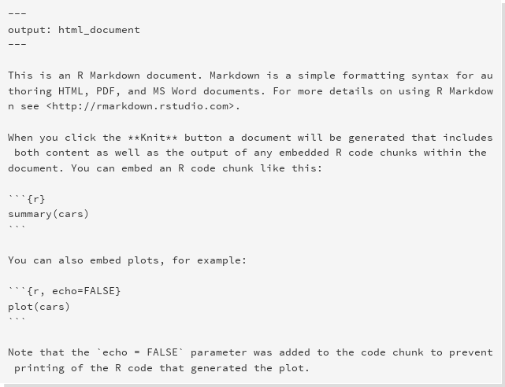

# Reproducible research

Reproducible research focuses on answering the following questions:

* How did you do that?
* What data did you use?
* Where is code used?

Essentially one wants to capture the typical workflow of:

* Preparing data
* Analysing the data
* Report on the findings
* Then realising that you did something wrong
* Do it all over again


"The final product of research is not only the paper itself, but also the full computation environment used to produce the results in the paper such as the code and data necessary for reproduction of the results and building upon the research." (Xie, 2014).


# Rmarkdown

A convenient tool to generate reproducible document. A R Markdown document is written in markdown (an easy-to-write plain text format) and contains chunks of embedded R code

* Markdown
  + Remove HTML tag for higher readibility.
  + Inline HTML is avaliable.
* R markdown
  + Markdown + embedded R code chunks
  + Rmd -> md -> docx, pdf,html
* Why R Markdown
  + Consolidate your code and document into single file.
  + Easy for version control




 


#### Excercise
* In Rstudio create a new markdown file

# Working with Markdown

Text formatting
```
#    1st level header  *a*    italics
##   2nd level header  **b**  bold
###  3rd level header

List:                  Hyperlinks
* item 1               [Hafro](www.hafro.is)
* item 2
  + subitem
```


Markdown also supports LaTeX equation so
```
$x^2 + \sum_i a_i y_i^n$
```
becomes
$$x^2 + \sum_i a_i y_i^n$$

Further reading: https://en.wikibooks.org/wiki/LaTeX/Mathematics


Tables in Markdown are fairly easy:
```
First Header  | Second Header
------------- | -------------
Content Cell  | Content Cell
Content Cell  | Content Ce
```
which becomes:

First Header  | Second Header
------------- | -------------
Content Cell  | Content Cell
Content Cell  | Content Cell


# Embedding R


Input from R in Markdown is evaluated in **chunks**:

```
 ```{r}
  #<insert R code for Markdown>
 ```
```

Chunks have a plethora of options available by default:
* Allows you to display or hide code
* Similarly display or hide its output
* Figure dimensions can be set (if created by in the chunk)

* eval = TRUE : Evaluate all or part of the current chunk
* echo = TRUE : Show all or part of the source code
* results = 'asis' : Writes raw output from R to the output document without markup. Helpful for creating tables with xtable. markup is the default.
* include = TRUE : Code chunk will be included in output. If you don't want a chunk in the output but still evaluated set this to FALSE
* fig.width controls the figure width (in inches)
* fig.height controls the figure height (in inches)
* fig.cap is the figure caption
* fig.align sets the alignment
* dev allows the user to specify the file type of the plot (png, pdf, bmp, etc..)


But one can also use R command to create tables. Note: Set results='asis' to write raw results from R into the output document
```{r,eval=FALSE}
library(knitr)
kable(tab,caption = 'This is a table')
```

# Output options

* Html, both slides and normal webpages
* Word, requires either Word or Libreoffice to display
* Pdf, requires LaTeX:


# Bibliography
* Bibtex style citations


