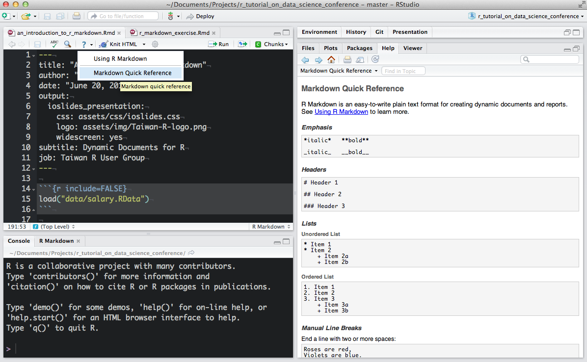

# Reproducible research
___

Reproducible research focuses on answering the following questions:

* How did you do that?
* What data did you use?
* Where is code used?

Essentially one wants to capture the typical workflow of:

* Preparing data
* Analyzing the data
* Report on the findings
* Then realizing that you did something wrong
* Do it all over again


"The final product of research is not only the paper itself, but also the full computation environment used to produce the results in the paper such as the code and data necessary for reproduction of the results and building upon the research." (Xie, 2014).


# Rmarkdown
___

A convenient tool to generate reproducible document. A R Markdown document is written in markdown (an easy-to-write plain text format) and contains chunks of embedded R code. This is a Rmarkdown document:

Notice that the file contains three types of content:

* An (optional) YAML header surrounded by `---`s
* R code chunks surrounded by ` ``` `s
* text mixed with simple text formatting

To generate a report from the file, run the render command:
```{r,eval=FALSE}
library(rmarkdown)
render("file.Rmd")
```

Better still, use the “Knit” button in the RStudio IDE to render the file and preview the output with a single click or keyboard shortcut ([ctrl/cmd]+[shift]+K). 

Rmarkdown documents can out of the box be rendered as:

* Html documents (webpages)
* Word documents
* PDF document


<div class="panel panel-warning">
<div class="panel-heading">Exercise</div>
<div class="panel-body">
In Rstudio create a new markdown file, play around with different rendering options 

</div>
</div>

# Working with Markdown
___

Markdown is designed to be easy to write, and, even more importantly, easy to read:

>  A Markdown-formatted document should be publishable as-is, as plain text, without looking like it’s been marked up with tags or formatting instructions. – John Gruber

Markdown does therefore only provides light text formating commands leaving the page layout to the renderer. When writing paragraphs you have the options of creating italicised text with encapsulating text with `*`. This means that is `*some text*` is rendered as *some text*. Simliarly bold text is indicated by encapsulating the text with `**`.  

Bulleted and numbered lists are created using single `*` so this bit of code:

~~~  
* Bla bla bla
* ble ble ble
~~~

becomes:

* Bla bla bla
* ble ble ble

You can create subitems in a list using:

~~~
* Bla bla bla
    * indented list item
* ble ble ble
~~~

which becomes

* Bla bla bla
    * indented list item
* ble ble ble
    
Numbered lists are simply generated with

~~~
1. bla bla bla
2. ble ble ble
~~~

which becomes 

1. bla bla bla
2. ble ble ble

Section heading are created with `#` followed with the section title. Subsections and subsubsections (and subsubsub...) are created similarly with `##` and `###` etc. So the following bits of text:

~~~
# Heading 
## Subheading 
### Subsubheading 
#### Subsubsubheading
~~~

is rendered as

# Heading 
## Subheading 
### Subsubheading 
#### Subsubsubheading


Mathematical formulas can also be rendered via the LaTeX equation environment, indicated by some commands enclosed by `$`-signs (`$$` to present the formula centered in a new line). So as a simple example the following bit of text:
```
$x^2 + \sum_i a_i y_i^n$
```
becomes
$$x^2 + \sum_i a_i y_i^n$$



Further reading: https://en.wikibooks.org/wiki/LaTeX/Mathematics


Tables in Markdown are fairly easy:
```
First Header  | Second Header
------------- | -------------
Content Cell  | Content Cell
Content Cell  | Content Ce
```
which becomes:

First Header  | Second Header
------------- | -------------
Content Cell  | Content Cell
Content Cell  | Content Cell


# Embedding R


Input from R in Markdown is evaluated in **chunks**:

~~~
 ```{r}
  #<insert R code for Markdown>
 ```
~~~

Chunks have a plethora of options available by default:

* Allows you to display or hide code
* Similarly display or hide its output
* Figure dimensions can be set (if created by in the chunk)

* eval = TRUE : Evaluate all or part of the current chunk
* echo = TRUE : Show all or part of the source code
* results = 'asis' : Writes raw output from R to the output document without markup. Helpful for creating tables with xtable. markup is the default.
* include = TRUE : Code chunk will be included in output. If you don't want a chunk in the output but still evaluated set this to FALSE
* fig.width controls the figure width (in inches)
* fig.height controls the figure height (in inches)
* fig.cap is the figure caption
* fig.align sets the alignment
* dev allows the user to specify the file type of the plot (png, pdf, bmp, etc..)


But one can also use R commands to create tables. Note: Set results='asis' to write raw results from R into the output document
```{r,eval=FALSE}
library(knitr)
kable(tab,caption = 'This is a table')
```


# Bibliography
* Bibtex style citations


